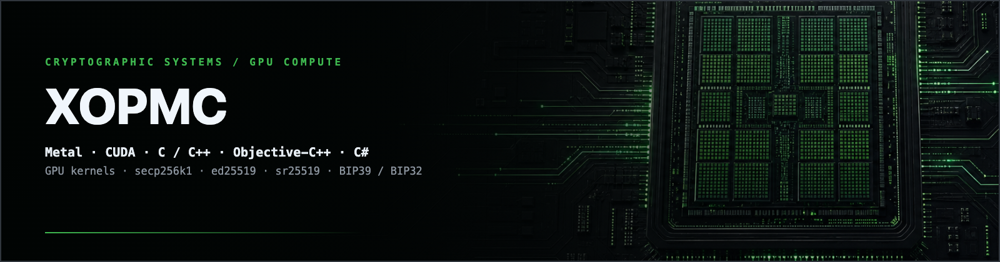
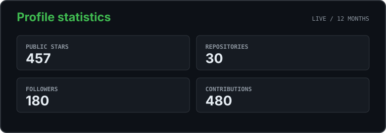
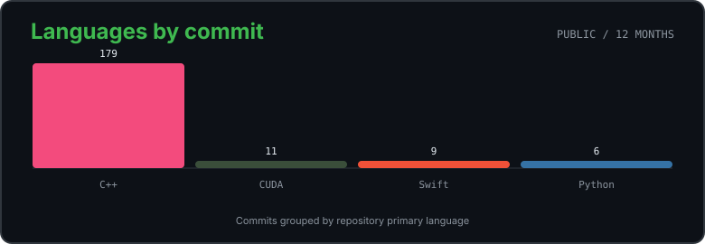
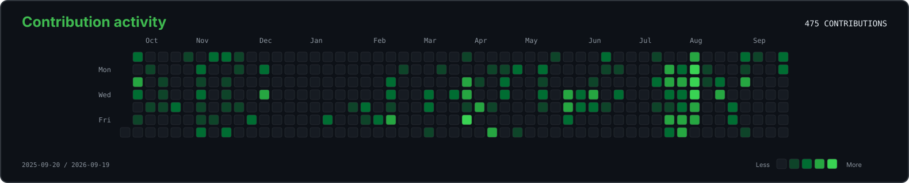

<p align="center">
  
</p>

<p align="center">
  <a href="https://t.me/xopmc"><strong>Telegram</strong></a>
  &nbsp;&middot;&nbsp;
  <a href="mailto:XopMC@yandex.ru"><strong>Email</strong></a>
  &nbsp;&middot;&nbsp;
  <a href="https://github.com/XopMC?tab=repositories"><strong>Open-source projects</strong></a>
</p>

## Core stack

`Metal` &middot; `CUDA` &middot; `C` &middot; `C++` &middot; `Objective-C++` &middot; `C#` &middot; `ARM64` &middot; `GPU kernels` &middot; `secp256k1` &middot; `ed25519` &middot; `sr25519` &middot; `BIP39 / BIP32` &middot; `Binary Fuse filters`

## Original projects

<table>
  <tr>
    <td width="50%" valign="top">
      <a href="https://github.com/XopMC/METAL_CRYPTO_TOOLKIT/stargazers"></a>
      <a href="https://github.com/XopMC/METAL_CRYPTO_TOOLKIT"><strong>METAL_CRYPTO_TOOLKIT</strong></a><br>
      <sub>Metal-accelerated cryptocurrency recovery and key research toolkit for macOS.</sub>
    </td>
    <td width="50%" valign="top">
      <a href="https://github.com/XopMC/C-Sharp-Mnemonic/stargazers"></a>
      <a href="https://github.com/XopMC/C-Sharp-Mnemonic"><strong>C-Sharp-Mnemonic</strong></a><br>
      <sub>Multicurrency BIP39 mnemonic and derivation toolkit for .NET.</sub>
    </td>
  </tr>
  <tr>
    <td width="50%" valign="top">
      <a href="https://github.com/XopMC/Mnemonic_CPP/stargazers"></a>
      <a href="https://github.com/XopMC/Mnemonic_CPP"><strong>Mnemonic_CPP</strong></a><br>
      <sub>Portable C++ toolkit for BIP39 and SLIP mnemonic workflows.</sub>
    </td>
    <td width="50%" valign="top">
      <a href="https://github.com/XopMC/CUDA_Mnemonic_Recovery/stargazers"></a>
      <a href="https://github.com/XopMC/CUDA_Mnemonic_Recovery"><strong>CUDA_Mnemonic_Recovery</strong></a><br>
      <sub>CUDA-accelerated BIP39 recovery with multi-GPU execution.</sub>
    </td>
  </tr>
  <tr>
    <td width="50%" valign="top">
      <a href="https://github.com/XopMC/XorFilter/stargazers"></a>
      <a href="https://github.com/XopMC/XorFilter"><strong>XorFilter</strong></a><br>
      <sub>Binary Fuse 4-wise XOR filter builder for large hexadecimal datasets.</sub>
    </td>
    <td width="50%" valign="top">
      <a href="https://github.com/XopMC/TONc/stargazers"></a>
      <a href="https://github.com/XopMC/TONc"><strong>TONc</strong></a><br>
      <sub>Portable zero-dependency TON address engine in C.</sub>
    </td>
  </tr>
</table>

> <a href="https://github.com/XopMC/Metal_Mnemonic_Recovery/stargazers"></a>
> **Specialized project:** [Metal_Mnemonic_Recovery](https://github.com/XopMC/Metal_Mnemonic_Recovery) - focused Metal implementation for BIP39 recovery on macOS.

## Selected ports & adaptations

| Project | Focus | Stars |
| --- | --- | ---: |
| [keyhunt-win](https://github.com/XopMC/keyhunt-win) | Windows adaptation of keyhunt | [](https://github.com/XopMC/keyhunt-win/stargazers) |
| [brainflayer-MultiBlooms](https://github.com/XopMC/brainflayer-MultiBlooms) | Extended brainflayer workflow with multiple Bloom filters | [](https://github.com/XopMC/brainflayer-MultiBlooms/stargazers) |
| [brainflayer-CUDA](https://github.com/XopMC/brainflayer-CUDA) | CUDA adaptation of brainflayer workloads | [](https://github.com/XopMC/brainflayer-CUDA/stargazers) |

## GitHub activity

<p align="center">
  
</p>

<p align="center">
  
</p>

<p align="center">
  
</p>

<sub>Language totals group public repositories by their primary GitHub language. Cards are generated from public GitHub data and updated daily.</sub>

## Contact & support

**Development:** GPU compute &middot; cryptographic systems &middot; performance engineering  
**Telegram:** [@xopmc](https://t.me/xopmc) &middot; [@brythbit](https://t.me/brythbit)  
**Email:** [XopMC@yandex.ru](mailto:XopMC@yandex.ru)

<details>
<summary><strong>Support development</strong></summary>

Send funds only through the network shown on the same line.

```text
ETH:    0xDE85c1Ef7874A1D94578f11332e8fa9A6a0eE853
BTC:    bc1q063pks7ex93eka56zyumvutdt6zs9dj959pe9p
LTC:    ltc1qysumht4lxafwvmcu4ruxzuztc2xmj8tz986fmm
TRX:    TTZ3oL16BVNzU46MSJvaoKYAhvtwdTUcnz
TON:    UQC7eqLN_NlVz82YzsjzAo4iOzKjH3t095-CMtqTJ5aoqo0l
DOT:    1jen89F5v6TbdQsRaKxsCqhNp9qAdeHeZyEUWjgrM8mW6hs
ADA:    addr1qx7qrlcy37xe7j58hjxmyhyqfgu0ppeqxzs43dayjjcgde973lzxgtgqzxdvfq3rswmngapc4sp528dpzfg7huam8v9san7h6z
DASH:   Xms41jaD967XMf2FAfEwGUxYKKhYQuok9T
SOLANA: BvDQDEgq3kbNT7VQFQRQPjc4Ta5k7d5s7GdcgoKnq3KG
```

</details>

<sub>Cryptographic recovery and research software must only be used with systems, wallets, and data you own or are explicitly authorized to test.</sub>
